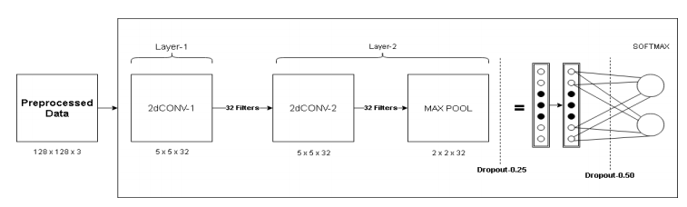
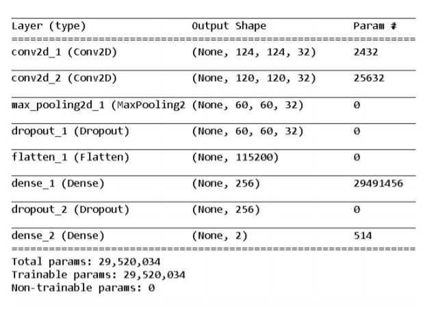
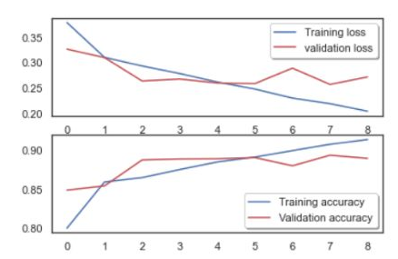

# Morphed_Image_Detector
Project which uses Convolutional Neural Network (CNN) in combination with Error Level Analysis (ELA) to detect Morphed/Fake images with  accuracy of 91.33% and convergence with only 9 epochs.

## Architecture

## Result

